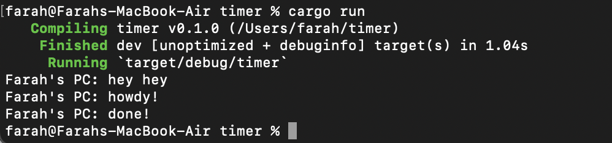
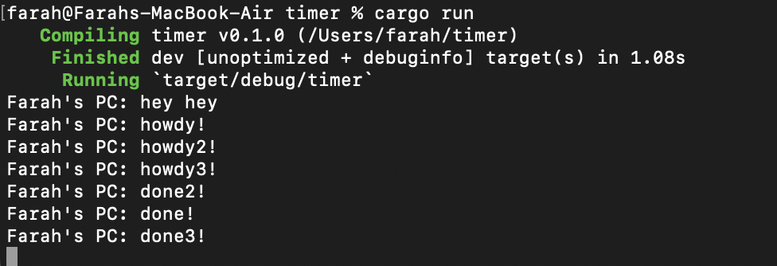

## Reflection
###### 1.2. Understanding how it works.

Setelah menjalankan cargo run, fungsi async akan berjalan di luar fungsi utama (main) yang memanggilnya. Maka dari itu, "hey hey" bisa keluar terlebih dahulu sebelum "howdy!" dan "done!" karena "hey hey" ada di luar fungsi async, sementara fungsi tersebut masih menunggu hasil dari future.

###### 1.3: Multiple Spawn and removing drop.
 .png)
Setelah menjalankan cargo run, terlihat bahwa dengan adanya banyak spawner, lebih banyak tugas dilakukan karena lebih banyak task yang dimasukkan ke dalam task sender yang bertindak seperti antrian pesan. Tidak drop spawner menyebabkan program tidak pernah berhenti karena program menganggap bahwa akan ada transmisi data oleh spawner. drop(spawner) sendiri merupakan indikasi bahwa interaksi sudah selesai dan spawner akan ditutup. Ketika spawner memanggil fungsi spawn, itu akan membuat task baru yang dikirim ke task sender. Eksekutor akan mengambil satu task dari task sender dan mengeksekusinya, lalu mengambil task lainnya sampai task habis dan spawner di drop yang menunjukkan interaksi sudah selesai.